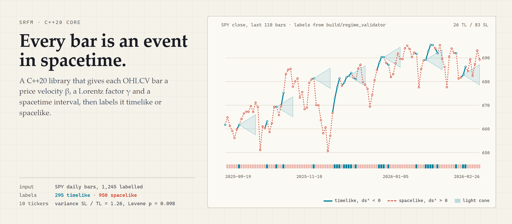
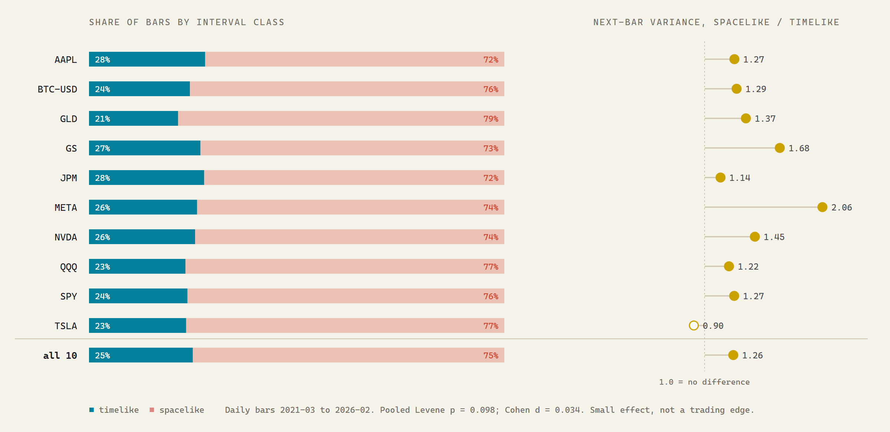

<picture>
  <source media="(prefers-color-scheme: dark)" srcset="assets/hero-dark.png">
  
</picture>

<p align="center">
  <a href="https://mattbusel.github.io/Special-Relativity-in-Financial-Modeling/"><b>Project site</b></a> &middot;
  <a href="#quick-start">Quick start</a> &middot;
  <a href="#what-the-core-computes">What it computes</a> &middot;
  <a href="#the-empirical-question">Results</a> &middot;
  <a href="#the-srfm-project-family">SRFM family</a>
</p>

<p align="center">
  <a href="https://github.com/Mattbusel/Special-Relativity-in-Financial-Modeling/actions/workflows/ci.yml"></a>
  <a href="LICENSE"></a>
</p>

# Special Relativity in Financial Modeling: the C++ core

SRFM treats every OHLCV bar as an event in a four-dimensional spacetime `(time, price, volume, momentum)`. This C++20 library computes each bar's price velocity **β** against a market "speed of information" `c`, its Lorentz factor **γ**, and the Minkowski interval **ds²** to the previous bar, then labels the bar **timelike** (ds² < 0, inside the light cone) or **spacelike** (ds² > 0, outside it). On top sit a metric tensor, Christoffel symbols, an RK4 geodesic solver and a geodesic-deviation signal, plus Python scripts that test whether the labels mean anything.

> **Research code, not financial advice.** This explores a mathematical analogy; it does not claim markets obey special relativity. Nothing here is a tested trading strategy.

## Quick start

CMake 3.25+ and a C++20 compiler (GCC 12+, Clang 17+ or MSVC 19.38+). Eigen is vendored in `third_party/`; GoogleTest, Google Benchmark and fmt are fetched on the first configure, so there is nothing to install first.

**Linux / macOS**

```bash
git clone https://github.com/Mattbusel/Special-Relativity-in-Financial-Modeling srfm
cd srfm
cmake -B build -G Ninja -DCMAKE_BUILD_TYPE=Release   # or drop -G Ninja for Makefiles
cmake --build build --parallel
ctest --test-dir build --output-on-failure --timeout 120
./build/regime_validator --input validation/data/SPY_1m.csv --output spy_regime.csv --ticker SPY
```

**Windows (Visual Studio 2022 or newer)**

```bat
git clone https://github.com/Mattbusel/Special-Relativity-in-Financial-Modeling C:\src\srfm
cd C:\src\srfm
cmake -B build -A x64
cmake --build build --config Release --parallel
ctest --test-dir build -C Release --output-on-failure --timeout 120
build\Release\regime_validator.exe --input validation\data\SPY_1m.csv --output spy_regime.csv --ticker SPY
```

Clone to a short path on Windows: MSBuild's intermediate files hit the 260-character path limit under deep directories. CI runs exactly these commands on `ubuntu-latest` and `windows-latest`.

What the last command prints (real output, SPY daily bars committed in the repo):

```text
$ ./build/regime_validator --input validation/data/SPY_1m.csv --output spy_regime.csv --ticker SPY
[SPY] Loaded 1256 bars
[SPY] Classified 1245 bars
  TIMELIKE:  295  (23.6948%)
  SPACELIKE: 950  (76.3052%)
  LIGHTLIKE: 0  (0%)
[SPY] Output written to spy_regime.csv
$ tail -3 spy_regime.csv
SPY,1252,Spacelike,0.0084382760,0.0084382760,0.9999000000,1.1822581722
SPY,1253,Spacelike,0.0055544060,-0.0055544060,0.9999000000,2.1046695934
SPY,1254,Spacelike,0.0048019696,-0.0048019696,0.9999000000,1.0605882118
```

Columns: `ticker, bar_index, interval_type, next_bar_abs_return, next_bar_return, beta, geodesic_deviation`. β is clamped at 0.9999, so on daily equity bars most values sit at the cap.

### What gets built

| Target | What it is |
|---|---|
| `regime_validator` | Reads an OHLCV CSV, labels every bar, writes the CSV that `validation/analyze_q1.py` consumes |
| `backtest_runner` | Geodesic-deviation strategy over a `regime_validator` output file |
| `lorentz_basics` | The library example below |
| `srfm` | Small CLI over `srfm::core::Engine`: `--backtest <csv>`, `--stream` (stdin), `--help` |
| `bench_beta_gamma` | Google Benchmark suite for the SIMD β/γ kernels |
| `srfm_*` static libraries | `momentum`, `lorentz`, `manifold`, `tensor`, `geodesic`, `engine`, `core`, `backtest`, `stream`, `portfolio`, `simd_*` and more; see `cmake/*.cmake` |
| test executables | 41 CTest suites (GoogleTest and small self-contained runners) |

## What the core computes

| Piece | What it does |
|---|---|
| **β and γ** | `lorentz::BetaCalculator` turns a window of prices into a velocity against `c`; `lorentz::LorentzTransform::gamma` returns γ = 1/√(1 − β²), with β clamped below `BETA_MAX_SAFE = 0.9999`. |
| **Interval class** | `manifold::MarketManifold::process` z-scores price, volume and momentum over a rolling window (`CoordinateNormalizer`, window 20), computes ds² = −c²dt² + dP² + dV² + dM² to the previous bar and classifies it as timelike, lightlike or spacelike. |
| **Curvature** | `MetricTensor`, Christoffel symbols by central differences or exact dual numbers, an RK4 geodesic solver, and a deviation signal between the observed path and the geodesic. |
| **Batch and streaming** | AVX2 / AVX-512 β and γ kernels with runtime dispatch, and a lock-free SPSC tick pipeline (`include/srfm/stream/`). |

### Use it as a library

[`examples/lorentz_basics.cpp`](examples/lorentz_basics.cpp) is compiled by CI; this is its source and its output.

```cpp
#include "srfm/manifold.hpp"
#include "lorentz/lorentz_transform.hpp"
#include <cstdio>

int main() {
    using srfm::BetaVelocity;
    using srfm::lorentz::LorentzTransform;
    using namespace srfm::manifold;

    for (double b : {0.0, 0.5, 0.9, 0.99})
        if (auto g = LorentzTransform::gamma(BetaVelocity{b}))
            std::printf("beta = %.2f   gamma = %.4f\n", b, g->value);

    // (time, price, volume, momentum), one time unit apart
    const SpacetimeEvent a{0.0, 100.0, 1.0, 0.0};
    const SpacetimeEvent slow{1.0, 100.4, 1.0, 0.0};
    const SpacetimeEvent fast{1.0, 103.0, 1.0, 0.0};
    for (const auto* b : {&slow, &fast}) {
        auto ds2 = SpacetimeInterval::compute(a, *b);
        auto cls = MarketManifold::classify(a, *b);
        if (ds2 && cls)
            std::printf("dP = %+.1f   ds2 = %+.2f   %s\n",
                        b->price - a.price, *ds2, to_string(*cls));
    }
}
```

```text
$ ./build/lorentz_basics
beta = 0.00   gamma = 1.0000
beta = 0.50   gamma = 1.1547
beta = 0.90   gamma = 2.2942
beta = 0.99   gamma = 7.0888
dP = +0.4   ds2 = -0.84   Timelike
dP = +3.0   ds2 = +8.00   Spacelike
```

Link against `srfm_manifold` and `srfm_lorentz` in your own CMake project, or install with `cmake --install build --prefix <dir>` and use `find_package(srfm CONFIG REQUIRED)` with `srfm::srfm_engine`, `srfm::srfm_tensor` and friends (the installed package needs Eigen 3.4 findable by CMake).

## The empirical question

The hypothesis: a spacelike bar (price moved "faster than light" for the time elapsed) is followed by more return variance than a timelike bar. `regime_validator` labels ten tickers and `validation/analyze_q1.py` compares next-bar variance between the two groups.

<picture>
  <source media="(prefers-color-scheme: dark)" srcset="assets/regimes-dark.png">
  
</picture>

| Pooled over 10 tickers | Committed (`validation/Q1_RESULTS.md`) | Re-run with today's build |
|---|---|---|
| Bars, timelike / spacelike | 3,256 / 9,855 | 3,252 / 9,769 |
| Variance ratio, spacelike / timelike | 1.27 | 1.26 |
| Bartlett p (assumes normal returns) | 6.0 x 10^-16 | 4.0 x 10^-15 |
| Levene p (robust to fat tails) | 0.083 | 0.098 |
| Cohen's d | 0.037 | 0.034 |
| Tickers significant after Bonferroni | 5 of 10 Bartlett, 0 of 10 Levene | 5 of 10 Bartlett, 0 of 10 Levene |

Read together: the direction matches the hypothesis and Bartlett is highly significant, but Bartlett is known to over-reject on fat-tailed returns, the robust Levene test is not significant at 5%, and the effect is small. Treat it as an open research result, not an edge. The re-run differs slightly because the current validator skips a warm-up window before labelling.

The files in `validation/data/` are named `*_1m.csv` but hold daily bars from March 2021 to February 2026 (about 1,256 per ticker). The paper describes a 1-minute Q1 2025 study whose data is not in this repository.

<details>
<summary><b>Reproduce the table and figures</b></summary>

```bash
for t in AAPL BTC_USD GLD GS JPM META NVDA QQQ SPY TSLA; do
  ./build/regime_validator --input validation/data/${t}_1m.csv --output out/${t}_regime.csv --ticker $t
done
pip install -r validation/requirements.txt
python validation/analyze_q1.py --results-dir out --output-dir q1
python scripts/figures/make_figures.py --results out --q1 q1 --out figs   # HTML pages, rendered to PNG with a headless browser
```

</details>

## Status

All 41 CTest suites pass (`100% tests passed, 0 tests failed out of 41`, MSVC Release, 2026-09-25), and CI runs them on Linux GCC and Windows MSVC for every push. Suites that ever regress can be parked in [`ci/known-failing-tests.txt`](ci/known-failing-tests.txt), which is empty today. The Python validation tests and the Rust unit tests run in CI too, minus the few listed in `ci/known-failing-pytest.txt` and `ci/known-failing-rust-tests.txt`.

- **C++20 core** (`include/`, `src/`, `cmake/`): the part this README documents. Built in CI with GCC and MSVC at `-Wall -Wextra -Wpedantic` / `/W4`; `-DSRFM_WARNINGS_AS_ERRORS=ON` turns warnings into errors.
- **Python layer**: `validation/` (data fetch, statistical tests, optimizer and dashboard demos) and `python/` (pure-Python fallback API and optional pybind11 bindings).
- **Rust layer** at the repository root: an experimental crate (`tokio-prompt-orchestrator`) holding an LLM orchestration service and exploratory physics-analogy modules. It is not needed for the C++ library. `cargo test --lib` runs its unit tests; the integration tests under `tests/*.rs` target modules that were removed and do not compile.
- **Paper**: `paper/` (LaTeX) and `Paper 1.1.pdf`.

## The SRFM project family

| Repository | What it is |
|---|---|
| **Special-Relativity-in-Financial-Modeling** (this repo) | C++20 core: β, γ, interval labels, Christoffel symbols and geodesic deviation on OHLCV bars, plus Python validation scripts |
| [srfm-lab](https://github.com/Mattbusel/srfm-lab) ([site](https://mattbusel.github.io/srfm-lab/)) | Multi-language research lab built on the idea: the black-hole signal, Monte Carlo backtests, a paper trader and an idea engine |
| [srfm-python](https://github.com/Mattbusel/srfm-python) | Pure-Python SDK: a pandas `df.srfm` accessor and a Polars wrapper for the Lorentz-factor pipeline |
| [srfm-paper-impl](https://github.com/Mattbusel/srfm-paper-impl) | The paper (PDF), scripts and a notebook that regenerate its figures, and a small Rust reference of the core formulas |

The Rust crate [fin-stream](https://github.com/Mattbusel/fin-stream) also ships a streaming `lorentz` module built on the same transform.

---

## Reference


<details>
<summary><b>Build options, targets and install</b></summary>

| CMake option | Default | Effect |
|---|---|---|
| `SRFM_WARNINGS_AS_ERRORS` | `OFF` | Adds `-Werror` / `/WX` on top of `-Wall -Wextra -Wpedantic` / `/W4` |
| `SRFM_BUILD_INTEGRATION_TESTS` | `ON` | Builds the `srfm::core::Engine` end-to-end suites |
| `SRFM_FUZZ` | `OFF` | Builds the libFuzzer targets in `fuzz/` (Clang only) |
| `CMAKE_BUILD_TYPE` | none | Use `Release` with single-config generators; pass `--config Release` with Visual Studio |

Optional packages are picked up when installed (for example through a vcpkg toolchain file): Eigen3, GTest, fmt, spdlog, Google Benchmark and RapidCheck. RapidCheck enables the ten `prop_*` property-test suites (10,000 inputs each); without it they are skipped. Everything else falls back to the vendored or fetched copy.

```bash
cmake --install build --prefix /usr/local
# downstream CMakeLists.txt:
#   find_package(srfm CONFIG REQUIRED)        # needs Eigen 3.4 findable too
#   target_link_libraries(app PRIVATE srfm::srfm_engine)
```

Python dependencies for `validation/`:

```bash
pip install -r validation/requirements.txt
# yfinance, pandas, numpy, scipy, matplotlib, seaborn, hypothesis
```

</details>

<details>
<summary><b>Repository layout and module graph</b></summary>

```
Special-Relativity-in-Financial-Modeling/
|
+-- include/srfm/              C++ core headers
|   +-- types.hpp              Strong types: BetaVelocity, LorentzFactor, EffectiveMass
|   +-- constants.hpp          BETA_MAX_SAFE, SPEED_OF_LIGHT, FLOAT_EPSILON
|   +-- momentum.hpp           MomentumProcessor, MomentumSignal
|   +-- manifold.hpp           SpacetimeEvent, SpacetimeInterval, IntervalClass
|   +-- tensor.hpp             MetricTensor, ChristoffelSymbols (autodiff + FD)
|   +-- engine.hpp             Engine (full pipeline wiring)
|   +-- backtest.hpp           Backtester, PerformanceCalculator, BacktestResult
|   +-- data_loader.hpp        DataLoader, OHLCV
|   +-- simd/                  CPU feature detection, AVX2/AVX-512 kernels
|   +-- stream/                Lock-free tick streaming pipeline
|   +-- multi_asset.hpp        MultiAssetEvent, MultiAssetInterval,
|                               CorrelationMetric, MultiAssetLorentz, PortfolioGeodesic
|
+-- include/                   N-asset portfolio headers
|   +-- portfolio_manifold.hpp AssetEvent, MinkowskiCovariance, SpacetimeCausalGraph
|   +-- relativistic_optimizer.hpp RelativisticPortfolio, OptimizationResult
|
+-- src/                       C++ implementation files
|   +-- core/                  srfm::core::Engine and DataLoader (OHLCV CSV)
|   +-- validation/            regime_validator and backtest_runner programs
|   +-- multi_asset.cpp        Multi-asset spacetime (built by python/setup.py)
|
+-- python/srfm/               Python interface (pybind11 / pure-Python fallback)
|   +-- __init__.py            Pure-Python fallback API (no build required)
|   +-- bindings.cpp           pybind11 C++ extension (optional)
|
+-- python/
|   +-- relfinance.py          Simplified pip-installable API (v2.0) -
|                              SpacetimeEvent, classify_events,
|                              portfolio_manifold, relativistic options
|
+-- examples/
|   +-- lorentz_basics.cpp     Compiled C++ example (gamma, interval class)
|   +-- stream_and_simd.cpp    Compiled C++ example (streaming beta, SIMD batch)
|   +-- quickstart.ipynb       Jupyter notebook: Python API walkthrough
|
+-- validation/                Python validation and tooling layer
|   +-- portfolio_optimizer.py  Relativistic portfolio optimizer (NEW v1.2.0)
|   +-- tick_streamer.py        Real-time tick streaming + SRFM signals (NEW v1.2.0)
|   +-- signal_dashboard.py     ANSI terminal real-time dashboard (NEW v1.2.0)
|   +-- analyze_q1.py           TIMELIKE vs SPACELIKE variance statistical tests
|   +-- empirical_extended.py  Extended crypto validation + LaTeX/Markdown report (NEW v2.0)
|   +-- backtest_comparison.py  Strategy comparison (RAW/RELATIVISTIC/GEODESIC)
|   +-- fetch_data.py           Yahoo Finance data downloader
|   +-- run_validation.py       Full validation pipeline runner
|   +-- requirements.txt        Python dependencies
|
+-- tests/                     C++ unit + integration test suites
+-- bench/                     Google Benchmark targets
+-- paper/                     LaTeX academic paper
+-- site/                      Project page (GitHub Pages)
+-- scripts/figures/           Builds the README and site figures from real output
+-- CMakeLists.txt
```

### Module dependency graph

```
srfm_momentum  <--  srfm_beta_calculator
srfm_momentum  <--  srfm_manifold
srfm_manifold  <--  srfm_geodesic
srfm_beta_calculator, srfm_manifold, srfm_geodesic  <--  srfm_engine
srfm_momentum  <--  srfm_simd_{scalar,avx2,avx512}  <--  srfm_simd_dispatch
srfm_manifold, srfm_tensor  <--  srfm_portfolio
srfm_engine, srfm_lorentz  <--  srfm_backtest  <--  srfm_core  <--  srfm (CLI)
```

</details>

<details>
<summary><b>Mathematical background</b></summary>

**Spacetime embedding.** Each bar becomes an event `(t, P, V, M)`: bar time, close price, volume, and a momentum proxy (`price_return * volume` in `srfm::core::Engine`). `regime_validator` z-scores P, V and M over a rolling 20-bar window (`CoordinateNormalizer`) before computing intervals, so the three spatial axes live on comparable scales.

**Velocity and Lorentz factor.**

```
beta  = |dP| / (c * dt)
gamma = 1 / sqrt(1 - beta^2),   |beta| < 1,  clamped at BETA_MAX_SAFE = 0.9999
```

**Interval.**

```
ds^2 = -(c*dt)^2 + dP^2 + dV^2 + dM^2
```

| Class | ds² | Model's reading |
|---|---|---|
| TIMELIKE | < 0 | Move inside the light cone; the hypothesis is that momentum carries information |
| LIGHTLIKE | ≈ 0 | On the cone |
| SPACELIKE | > 0 | Move "faster than light" for the time elapsed; treated as noise |

**Relativistic momentum signal.** `p_rel = gamma(beta) * m_eff * p_raw`.

**Geodesics.** `d²x^mu/dtau² + Gamma^mu_{nu rho} (dx^nu/dtau)(dx^rho/dtau) = 0`, integrated with RK4. Christoffel symbols come from O(h²) central differences or exact forward-mode dual numbers (eps² = 0). Deviation from the geodesic is the `geodesic_deviation` column.

**Relativistic Sharpe.** `SR_rel = (w^T mu - rf) / sqrt(w^T Sigma_st w)`, where `Sigma_st` discounts the covariance of SPACELIKE asset pairs by `(1 - s_i * s_j)` with `s_k = 1 - timelike_fraction_k`.

</details>

<details>
<summary><b>C++ API samples</b></summary>

**Core engine and CSV loader** (`include/srfm/engine.hpp`, `include/srfm/data_loader.hpp`, target `srfm_core`). `DataLoader` accepts numeric or ISO-8601 timestamps. `c` defaults to 1.0 in price units, so on dollar prices β saturates at the cap; set `EngineConfig::max_market_velocity` to your instrument's scale.

```cpp
#include "srfm/engine.hpp"
#include "srfm/data_loader.hpp"

auto bars = srfm::core::DataLoader::load_csv("prices.csv");   // std::optional<std::vector<OHLCV>>
if (bars) {
    srfm::core::Engine engine;                                 // EngineConfig{} by default
    if (auto cmp = engine.run_backtest(*bars)) {
        // cmp->raw and cmp->relativistic are PerformanceMetrics
        std::printf("%s\n", cmp->to_string().c_str());
    }
}
```

**N-asset portfolio manifold** (`include/portfolio_manifold.hpp`)

```cpp
#include "portfolio_manifold.hpp"
using namespace srfm::portfolio;

MinkowskiCovariance mc;
mc.add_asset(AssetEvent{"AAPL", 1.0, 150.0, 1e8, 2.4e12});
mc.add_asset(AssetEvent{"MSFT", 1.0, 290.0, 8e7, 2.1e12});
auto cov = mc.compute_spacetime_covariance();
// cov(i,j) = exp(-|ds^2(i,j)|), a Gaussian kernel over the spacetime interval
```

**Relativistic optimizer** (`include/relativistic_optimizer.hpp`)

```cpp
#include "relativistic_optimizer.hpp"
using namespace srfm::portfolio;

RelativisticPortfolio rp;
rp.add_asset(AssetEvent{"AAPL", 1.0, 150.0, 1e8, 2.4e12}, 0.12);
rp.add_asset(AssetEvent{"MSFT", 1.0, 290.0, 8e7, 2.1e12}, 0.10);
rp.add_asset(AssetEvent{"GOOG", 1.0, 140.0, 6e7, 1.8e12}, 0.09);
if (auto result = rp.optimize_weights(0.08)) {   // target 8% return
    std::cout << result->weights.transpose() << "\n" << result->geodesic_risk << "\n";
}
```

**Streaming and SIMD** ([`examples/stream_and_simd.cpp`](examples/stream_and_simd.cpp), compiled in CI)

```cpp
#include <srfm/stream/beta_calculator.hpp>
#include <srfm/stream/lorentz_transform.hpp>
#include <srfm/simd/simd_dispatch.hpp>

srfm::stream::BetaCalculator<8> beta_calc;      // rolling window of 8 returns (N <= 64)
srfm::stream::LorentzTransform boost;
for (std::size_t i = 0; i < closes.size(); ++i) {
    beta_calc.update(closes[i]);
    if (beta_calc.warmed_up()) {
        auto ev = boost.transform(double(i), closes[i], beta_calc.beta());
        std::printf("t=%zu beta=%.4f gamma=%.4f\n", i, ev.beta, ev.gamma);
    }
}

// Dispatches to AVX-512, AVX2 or scalar at runtime.
double running_max = 0.0;
auto betas  = srfm::simd::computeBetaBatch(velocities, running_max);  // beta = |v| / running max
auto gammas = srfm::simd::computeGammaBatch(betas);
```

```text
$ ./build/stream_and_simd
t=8 beta=0.0992 gamma=1.0050
t=9 beta=0.1113 gamma=1.0062
4 betas, gamma[2]=70.7124
```

The batch β divides by the running maximum velocity, so the largest input maps to the 0.9999 cap and γ ≈ 70.7.

</details>

<details>
<summary><b>Testing</b></summary>

```bash
ctest --test-dir build --output-on-failure --timeout 120    # everything
ctest --test-dir build -R LorentzTransformTests              # one suite

# AddressSanitizer + UBSan (GCC / Clang)
cmake -B build-asan -DCMAKE_BUILD_TYPE=Debug -DCMAKE_CXX_FLAGS="-fsanitize=address,undefined"
cmake --build build-asan && ctest --test-dir build-asan --output-on-failure

# Python validation tests
pip install -r validation/requirements.txt pytest && pytest validation/pytest -v
```

CI runs every suite except those listed in [`ci/known-failing-tests.txt`](ci/known-failing-tests.txt).

The 41 CTest suites cover: momentum and edge cases; Lorentz transform, β calculator and online β; Lorentz invariants; metric tensor, Christoffel symbols (finite-difference and dual-number), metric singularity and geodesics; interval gaps; SIMD agreement across scalar, AVX2 and AVX-512; backtester, performance metrics, γ-sizing and precision; the event-driven backtester; portfolio manifold, optimizer, geodesic path, Minkowski momentum and proper time; five N-asset suites; nine lock-free streaming suites; and the `srfm::core::Engine` integration suites.

</details>

<details>
<summary><b>Performance</b></summary>

`bench_beta_gamma` measures the scalar, AVX2 and AVX-512 batch β and γ kernels and the runtime dispatcher with Google Benchmark. [`bench/BENCHMARK_RESULTS.md`](bench/BENCHMARK_RESULTS.md) records one earlier run on an Intel Xeon (Ice Lake); only that hand-written summary is committed, and it has not been reproduced for this README, so no speedup is claimed here. The benchmark skips the AVX-512 cases on CPUs without AVX-512F. Run it on your own hardware:

```bash
cmake --build build --config Release --target bench_beta_gamma
./build/bench_beta_gamma --benchmark_repetitions=5 --benchmark_display_aggregates_only=true
```

`BENCHMARKS.md` at the repository root describes the Rust layer, not these kernels.

</details>

<details>
<summary><b>Crypto validation (Binance API)</b></summary>


Extended validation across BTC, ETH, and configurable altcoins using
public Binance kline data.  Tests whether the TIMELIKE/SPACELIKE
classification replicates the equity variance result in 24/7 crypto markets.

Statistical pipeline:
- **Bootstrap CI** (10,000 replications) on mean next-bar |return| per regime.
- **Permutation test** (10,000 shuffles) for the TIMELIKE vs SPACELIKE mean-vol
  null hypothesis.
- **RSI and MACD benchmarks** via Mann-Whitney U, allows direct comparison of
  SRFM predictive power against standard technical analysis.
- **LaTeX + Markdown report** with full confidence intervals.

```bash
python validation/empirical_extended.py \
    --symbols BTCUSDT ETHUSDT SOLUSDT \
    --interval 1h --limit 1000 \
    --n-boot 10000 --n-perm 10000 \
    --format both

# Output files:
#   validation/crypto_validation_report.md
#   validation/crypto_validation_report.tex
```

---

</details>

<details>
<summary><b>Feature guides (C++, Python, Rust)</b></summary>

Detailed notes per feature, in roughly the order they were added.

### Lorentz Portfolio Transformation

#### Header: `include/srfm/lorentz_portfolio.hpp`  |  Source: `src/lorentz_portfolio.cpp`

Interprets a portfolio's statistical moments as a 4-vector in financial spacetime and applies a Lorentz boost along the return-volatility plane.

**Portfolio 4-vector:**

```
p^μ = (ret, vol, skew, kurt)
```

**Boost transformation (β ∈ (-1, 1), γ = 1/√(1 − β²)):**

```
ret'  = γ (ret  − β · vol)
vol'  = γ (vol  − β · ret)
skew' = skew               (transverse, unchanged)
kurt' = kurt               (transverse, unchanged)
```

**Minkowski invariant (conserved under all boosts):**

```
I = ret² − vol² − skew² − kurt²
```

| Class | Role |
|---|---|
| `PortfolioFourVector` | Portfolio moments `(ret, vol, skew, kurt)` with `sharpe()` helper |
| `LorentzFactor` | γ = 1/√(1 − β²); throws `std::domain_error` if \|β\| ≥ 1 |
| `LorentzBoost::transform(pf, β)` | Apply boost, returns boosted `PortfolioFourVector` |
| `PortfolioInvariant::compute(pf)` | Minkowski norm squared I |
| `OptimalBoost::find(target_sharpe, pf, step)` | Grid-search β ∈ (−0.99, 0.99) to maximise ret'/vol' |

```cpp
#include "srfm/lorentz_portfolio.hpp"
using namespace srfm::portfolio;

PortfolioFourVector pf;
pf.ret = 0.12; pf.vol = 0.10; pf.skew = 0.3; pf.kurt = 1.5;

// Apply boost
auto boosted = LorentzBoost::transform(pf, 0.5);
// boosted.sharpe() >= pf.sharpe() for appropriate beta

// Verify invariance
double I  = PortfolioInvariant::compute(pf);
double Ib = PortfolioInvariant::compute(boosted);
// |I - Ib| < 1e-8

// Find optimal beta
double beta_opt = OptimalBoost::find(1.5, pf, 0.01);
```

**Tests:** `tests/lorentz/test_lorentz_portfolio.cpp` (20+ GTest cases)

### Round 2 Features

> `src/causal_cone.cpp` and `src/hawking.cpp` are not part of any CMake target yet, so the APIs below are documented in their headers but not built or tested by CMake.

#### Causal Cone Filter (`include/srfm/causal_cone.hpp` + `src/causal_cone.cpp`)

Applies the light-cone causality concept to financial OHLCV bar sequences.
For each bar B, only past bars A with `ds²(A→B) < 0` (TIMELIKE) are considered
causally connected, SPACELIKE bars are excluded as "causally disconnected" noise.

**Core types**:

| Type | Responsibility |
|------|----------------|
| `CausalHistory` | Causal predecessors of one bar; `causal_fraction()` metric |
| `CausalConeFilter` | Scans a bar sequence and builds `CausalHistory` for every bar |
| `CausalSignal` | Feature vector built only from causal bars (mean return, vol, momentum) |
| `CausalBacktest` | Comparison: `CausalSignal` strategy vs all-bars baseline |

**Hypothesis**: signals derived exclusively from causally-connected bars should
exhibit higher predictive accuracy because they exclude stochastic SPACELIKE noise.

```cpp
CausalConeFilter::Config cfg;
cfg.look_back = 20;
CausalConeFilter filter(cfg);

auto histories = filter.build_histories(bars, events);
for (std::size_t i = 0; i < bars.size(); ++i) {
    auto sig = filter.compute_signal(histories[i], returns, i);
    if (sig) {
        // sig->causal_mean_return  , mean return of causal-only bars
        // sig->causal_fraction     , fraction of look-back bars that are causal
        // sig->all_bars_mean_return, baseline (for comparison)
    }
}

// Full comparison backtest:
CausalBacktest cb;
auto result = cb.run(bars);
fmt::print("{}\n", result->to_string());
// prints CausalSharpe, BaselineSharpe and SharpeImprovement for your data
```

---

#### Hawking Radiation Analogy (`include/srfm/hawking.hpp` + `src/hawking.cpp`)

Applies the Hawking radiation concept to detect price "event horizons":
points of no return where a trend exhausts itself.

**Hawking Temperature formula**:

```
T_H(t) = z(t) × Δz(t)
```

where `z = (P − μ) / σ` is the Bollinger Band z-score.

- **High T_H** → price accelerating towards the band edge → high entropy → reversal
- **Low T_H** → price decelerating → continuation
- **Event horizon** → `|z| ≥ bb_sigma` (outside the 3σ Bollinger Band)

**Signal classification**:

| T_H | Direction | Action |
|-----|-----------|--------|
| `> +2.0` | Reversal | Fade the extreme move |
| `< −2.0` | Continuation | Follow the trend |
| `[−2, +2]` | Neutral | No position |

```cpp
HawkingSignalGenerator gen;
for (const auto& bar : bars) {
    auto sig = gen.update(bar.close);
    if (sig && sig->direction != HawkingDirection::Neutral) {
        // sig->action:     +1 (buy), -1 (sell)
        // sig->strength:   normalised |T_H| in [0, 1]
        // sig->temperature.z_score: current Bollinger z-score
    }
}

// Backtest vs TIMELIKE classifier:
HawkingBacktest hb;
auto result = hb.run(bars);
fmt::print("{}\n", result->to_string());
```

**Key types**:
- `HawkingTemperature { temperature, z_score, delta_z, bollinger_mean, bollinger_std, near_horizon }`
- `HawkingSignal { temperature, direction, strength, action }`
- `PriceEventHorizon`, stateful Bollinger Band tracker
- `HawkingBacktest`, comparison against the TIMELIKE baseline

### Round 3: Event-Driven Backtester

#### Event-Driven Backtester (`include/srfm/event_backtester.hpp` + `src/event_backtester.cpp`)

A lightweight priority-queue event simulation engine that replays market events in strict timestamp order and dispatches them to a pluggable `Strategy`.

| Type | Role |
|---|---|
| `BacktestEvent` | Market event: timestamp_ms, price, volume, EventType (Trade/Quote/Bar), symbol |
| `BacktestEngine` | Priority-queue event loop; `add_event()`, `run()` → `BacktestResult` |
| `Strategy` | Abstract base: `on_trade()`, `on_bar()`, `on_start()`, `on_end()` |
| `Order` | Symbol, Buy/Sell side, quantity, Market/Limit type, limit_price |
| `Fill` | Confirmed execution: fill_price, fill_qty, commission |
| `Portfolio` | cash, positions map, equity_curve vector |
| `BacktestResult` | total_return, sharpe_ratio, max_drawdown, num_trades, win_rate, profit_factor |
| `RelativisticStrategy` | Concrete strategy: rejects spacelike events via `SpacetimeInterval::classify()` |

```cpp
#include "srfm/event_backtester.hpp"
using namespace srfm::event_bt;

// Use the built-in relativistic strategy (filters spacelike events)
BacktestEngine engine(100'000.0, 0.001);
engine.set_strategy(std::make_unique<RelativisticStrategy>(1.0, 0.001));

// Feed events (price bars at 1-minute intervals)
for (int i = 0; i < 100; ++i) {
    engine.add_event({
        .timestamp_ms = static_cast<long long>(i) * 60'000LL,
        .price        = 100.0 + i * 0.1,
        .volume       = 1000.0,
        .type         = EventType::Bar,
        .symbol       = "BTC",
    });
}

BacktestResult r = engine.run();
std::cout << "Total return: " << r.total_return * 100 << "%\n";
std::cout << "Sharpe ratio: " << r.sharpe_ratio << "\n";
std::cout << "Max drawdown: " << r.max_drawdown * 100 << "%\n";
```

##### RelativisticStrategy: The Core Idea

`RelativisticStrategy` converts each pair of consecutive market events into `SpacetimeEvent` structs and calls `SpacetimeInterval::classify()`:

- `ds² < 0` (TIMELIKE): the price move is causally connected to the previous event, the strategy generates a momentum order.
- `ds² > 0` (SPACELIKE): the move is faster than the market's "speed of information", the event is rejected as stochastic noise.

This means only trades that respect the relativistic causal structure of financial spacetime are acted upon. `spacelike_rejections()` and `timelike_accepts()` counters are exposed for post-run analysis.

The CMake library target is `srfm_event_backtest`; link it with `-lsrfm_event_backtest -lsrfm_manifold -lsrfm_backtest`.

### Round 5: Geodesic Portfolio Path

#### Header: `include/srfm/geodesic_path.hpp`  |  Source: `src/geodesic_path.cpp`

In financial spacetime, the **geodesic** between two portfolio states is the path of minimum action under the Lagrangian:

```
L = (1/2) ||dw/dt||^2 - V(w),   V(w) = lambda * sum(w_i^2)
```

The Euler-Lagrange equations yield simple harmonic oscillator motion per weight dimension:

```
d^2w_i/dt^2 = -2 * lambda * w_i    (omega = sqrt(2 * lambda))
```

**Analytical solution** with boundary conditions `w_i(0) = start[i]`, `w_i(1) = end[i]`:

```
w_i(t) = A_i * cos(omega * t) + B_i * sin(omega * t)
```

| Class | Role |
|---|---|
| `PortfolioState` | `weights: vector<double>` + `timestamp_ms: int64_t` |
| `Geodesic` | `states: vector<PortfolioState>`, discretised path from start to end |
| `GeodesicSolver::solve(start, end, n_steps, lambda)` | Returns a `Geodesic` with `n_steps+1` waypoints satisfying boundary conditions |
| `GeodesicLength::compute(geodesic)` | Integrated arc length `sum(||dw_i - dw_{i-1}||)` |

**Library target:** `srfm_geodesic_path`
**Tests:** `tests/portfolio/test_geodesic_path.cpp` (20+ GTest tests, `test_geodesic_path` binary)

```cpp
#include "srfm/geodesic_path.hpp"
using namespace srfm::portfolio;

PortfolioState start{{0.2, 0.5, 0.3}, 0};
PortfolioState end  {{0.4, 0.3, 0.3}, 1000};

Geodesic path = GeodesicSolver::solve(start, end, /*n_steps=*/50, /*lambda=*/0.5);
double length = GeodesicLength::compute(path);
```

### Round 6: Minkowski Momentum

#### Header: `include/srfm/minkowski_momentum.hpp`  |  Source: `src/minkowski_momentum.cpp`

Extends classical momentum to financial spacetime by representing a portfolio's
exposure profile as a **four-momentum vector** `p^μ = (E, p_x, p_y, p_z)`:

| Component | Physics | Finance |
|-----------|---------|---------|
| `E`   | Energy (time-like) | Portfolio return |
| `p_x` | x-momentum | Equity exposure |
| `p_y` | y-momentum | Bond exposure |
| `p_z` | z-momentum | Commodity exposure |

##### Invariant Mass (Diversification Measure)

```
m² = E² - p_x² - p_y² - p_z²
```

A portfolio with `m² > 0` (time-like) has total return exceeding its combined
directional exposures, the financial analogue of a well-diversified, non-tachyonic
portfolio.  The signed square root `m = sign(m²) * sqrt(|m²|)` is the
**Minkowski invariant mass** and is preserved under all Lorentz boosts (regime
transformations).

##### Rapidity (Financial Velocity in Equity Space)

```
y = 0.5 * ln((E + p_x) / (E - p_x))
```

Rapidity is additive under successive equity-space boosts, making it a natural
measure of compounded equity momentum that avoids the non-additivity of ordinary
velocity.

##### API

| Class | Key Methods |
|-------|-------------|
| `FourMomentum` | Data struct: `energy`, `px`, `py`, `pz` |
| `MinkowskiMomentum` | `invariant_mass_sq(p)`, `invariant_mass(p)`, `rapidity(p)`, `transverse_momentum(p)`, `spatial_magnitude(p)` |
| `FourMomentumConservation` | `sum(trades)`, `conserves(trades, reference, tol)` |
| `MomentumPortfolioOptimizer` | `optimize(returns, exposures, config)`, gradient-ascent maximises `m²` |

##### Build

```cmake
# Automatically built via cmake/momentum.cmake
target_link_libraries(my_target PRIVATE srfm_minkowski_momentum)
```

```cpp
#include "srfm/minkowski_momentum.hpp"
using namespace srfm::minkowski_momentum;

FourMomentum p{0.12, 0.08, 0.03, 0.01};
auto m = MinkowskiMomentum::invariant_mass(p);   // diversification score
auto y = MinkowskiMomentum::rapidity(p);          // equity-space rapidity
```

**Tests:** `tests/portfolio/test_minkowski_momentum.cpp`, 20+ GTest cases covering
invariant mass algebra, Lorentz invariance, rapidity edge cases, conservation checks,
and the gradient-ascent portfolio optimiser.

### Round 7: Proper Time Portfolio

#### Header: `include/srfm/proper_time.hpp`  |  Source: `src/proper_time.cpp`

Models portfolio dynamics using the proper time formalism from Special Relativity.  A high-volatility ("fast-moving") portfolio is analogous to a relativistic observer: it experiences less proper time per calendar day, effectively taking longer to reach the same information state.

| Class | Role |
|---|---|
| `ProperTime` | Static helpers: `compute(t, v)`, `gamma_factor(v)`, `to_velocity(vol, max_vol)` |
| `ProperTimeClock` | Integrates `dτ = dt / γ(v)` over streaming volatility observations |
| `PortfolioAgingModel` | Computes `effective_age = t * γ` and `adj_sharpe = sharpe / √(effective_age)` |
| `RelativisticRebalanceTimer` | Fires rebalance events when accumulated proper time `Δτ > threshold`, reduces turnover in high-vol regimes |

**Tests:** `tests/portfolio/test_proper_time.cpp`, 25 GTest cases covering all classes and edge conditions.

### Multi-asset spacetime and Python bindings

#### Multi-Asset Spacetime (`include/srfm/multi_asset.hpp`)

`src/multi_asset.cpp` is compiled by `python/setup.py` for the Python extension, not by CMake.

Extends the single-asset framework to handle N correlated financial assets
simultaneously, using a rolling correlation-based Lorentzian metric.

| Class | Responsibility |
|-------|----------------|
| `MultiAssetEvent` | N-asset spacetime event: `symbols`, `prices`, `volumes`, `timestamp` |
| `MultiAssetInterval` | ds² in (N+1)-dimensional spacetime using the full metric tensor |
| `CorrelationMetric` | Rolling correlation matrix → Lorentzian (N+1)×(N+1) metric with Cholesky regularisation |
| `MultiAssetLorentz` | Per-asset and portfolio Lorentz boosts; metric-weighted portfolio β |
| `PortfolioGeodesic` | Inertial portfolio trajectory; geodesic deviation as trading signals; geodesic weights |

#### Python Bindings (`python/srfm/`)

Full Python API via pybind11, with a pure-Python fallback (no build required):

```python
from srfm import SpacetimeInterval, LorentzTransform, Backtester

# Classify an OHLCV bar
SpacetimeInterval.classify(dt=1.0, dp=0.5, dv=0.1, dm=0.05)
# → 'TIMELIKE'

# Lorentz factor
LorentzTransform.gamma(beta=0.8)
# → 1.6666666666666667

# Full relativistic backtest
result = Backtester().run(prices=[100, 101, 99, 102, 103])
print(result.sharpe)            # relativistic Sharpe ratio
print(result.relativistic_lift) # IR_γ lift factor
print(result.to_string())       # formatted comparison table
```

```bash
# Install (pure-Python, no build required):
pip install -e python/

# Or with the C++ extension (setup.py builds it when pybind11 is installed):
pip install pybind11
pip install -e python/
```

See [`examples/quickstart.ipynb`](examples/quickstart.ipynb) for a complete walkthrough.

### Rust modules: options pricing, crypto validation, plotter

#### Relativistic Options Pricing (`src/relativistic_options.rs`)

Full options pricing framework extending the financial manifold to derivative
instruments.  Replaces Black-Scholes constant-vol assumption with the
Minkowski spacetime interval derived from the underlying's price trajectory.

| Type | Description |
|------|-------------|
| `RelativisticBlackScholes` | B-S where σ is replaced by the spacetime metric |
| `LightconeOptionPricing` | Two-regime vol surface: TIMELIKE < σ_base < SPACELIKE |
| `SpacetimeDelta` | Relativistic hedge ratio Δ_rel = γ(β) · Δ_BS |
| `RelOrbitArbitrage` | Flags options mispriced relative to spacetime regime |

Key derivations:

- **Effective volatility**: `σ_eff = σ_base · √(1 − β²)` for TIMELIKE, enhanced
  for SPACELIKE by `σ_base / γ`.
- **Proper-time discounting**: expiry discounted at `e^{−rτ}` where
  `τ = T · √(1 − β²) < T` for TIMELIKE trajectories.
- **Relativistic delta**: `Δ_rel = γ(β) · N(d₁)`, larger hedge in fast-moving
  regimes because a unit price move covers more proper distance.
- **Arbitrage signal**: contradiction between TIMELIKE/SPACELIKE label and
  market implied vol direction generates a signed mispricing score.

```rust
use tokio_prompt_orchestrator::relativistic_options::{
    RelativisticBlackScholes, LightconeOptionPricing,
    SpacetimeDelta, RelOrbitArbitrage, OptionsConfig,
};

let cfg = OptionsConfig::default();
let model = RelativisticBlackScholes::new(cfg.clone());

// Price a call: S=100, K=105, T=0.25yr, dt=1, dp=2.0
let result = model.price_call(100.0, 105.0, 0.25, 1.0, 2.0).unwrap();
println!("Call price: {:.4}", result.price);
println!("σ_eff:      {:.4}", result.sigma_effective);
println!("Regime:     {}", result.interval_class);   // TIMELIKE / SPACELIKE
println!("γ:          {:.4}", result.gamma);

// Light-cone vol surface
let pricer = LightconeOptionPricing::new(cfg.clone());
let lc = pricer.price(100.0, 100.0, 1.0, 0.3, true).unwrap();
println!("σ_TL={:.4}  σ_SL={:.4}", lc.sigma_timelike, lc.sigma_spacelike);

// Relativistic delta
let sd = SpacetimeDelta::new(cfg.clone());
let dr = sd.compute(100.0, 100.0, 1.0, 0.20, 1.0, 1.0, true).unwrap();
println!("Δ_classical={:.4}  Δ_rel={:.4}", dr.delta_classical, dr.delta_relativistic);

// Arbitrage scan (provide market price to detect mispricing)
let arb = RelOrbitArbitrage::new(cfg, 0.05);
let sig = arb.scan(100.0, 100.0, 1.0, 1.0, 0.5, Some(12.0), true).unwrap();
println!("Arb type: {}  score: {:.4}", sig.arb_type, sig.score);
```

---

#### Extended Crypto Empirical Validation (`validation/empirical_extended.py`)

Extends the Q1 2025 equity validation to cryptocurrency markets (BTC, ETH,
and configurable altcoins) via the public Binance REST API.

**Statistical tests:**
- Bootstrap resampling (default 10,000 replications) for mean next-bar vol CI.
- Permutation test (default 10,000 shuffles) for TIMELIKE vs SPACELIKE vol equality.
- Bartlett test for variance equality.
- Bonferroni correction across all assets.

**Benchmarks:**
- RSI overbought/oversold (Mann-Whitney U) vs SRFM classification.
- MACD histogram direction (Mann-Whitney U) vs SRFM classification.

**Output:** LaTeX + Markdown reports with confidence intervals.

```bash
# Quick run (BTC + ETH, 1h bars, 1000 bars each)
python validation/empirical_extended.py

# Custom symbols and interval
python validation/empirical_extended.py \
    --symbols BTCUSDT ETHUSDT SOLUSDT \
    --interval 4h \
    --limit 1000 \
    --n-boot 10000 \
    --n-perm 10000 \
    --format both

# Offline (uses cached CSV data)
python validation/empirical_extended.py --no-download
```

```python
from validation.empirical_extended import CryptoValidation, ValidationReport

validator = CryptoValidation(
    symbols=["BTCUSDT", "ETHUSDT"],
    interval="1h",
    limit=500,
    c_scale=0.05,
    n_boot=1000,
    n_perm=1000,
)
results = validator.run()

# Print vol ratio for each asset
for sym, r in results.items():
    print(f"{sym}: TL/SL vol ratio = {r.vol_ratio_tl_sl:.4f}")

# Generate LaTeX + Markdown reports
report = ValidationReport(results, output_dir="validation")
report.generate_all(fmt="both")
```

---

#### Interactive Spacetime Visualization (`src/viz.rs`, `viz` feature)

Interactive egui-based visualizations for the SRFM financial manifold.

```bash
# Build with the viz feature
cargo build --features viz
# There is no command-line entry point for the plotter yet: construct
# SpacetimePlotter / PortfolioManifoldViewer inside your own eframe app.
```

**`SpacetimePlotter`**, 2D Minkowski diagram:
- Light cone lines at slope ±1/c from the most recent event.
- Price worldline rendered as a colored polyline.
- Per-event color coding: blue (β ≈ 0) → red (|β| → 1).
- Geodesic best-fit path (OLS constant-velocity trajectory).
- Interactive zoom (scroll) and inspect panel (hover).

**`PortfolioManifoldViewer`**, 3D scatter plot:
- TIMELIKE dots in green, SPACELIKE in red, LIGHTLIKE in yellow.
- Drag to rotate (azimuth + elevation camera).
- Scroll to zoom.
- Click a dot to inspect full event details in the side panel.

```rust
use tokio_prompt_orchestrator::viz::{
    SpacetimePlotter, SpacetimePlotterConfig,
    PortfolioManifoldViewer, ManifoldViewerConfig, AssetPoint,
};

let mut plotter = SpacetimePlotter::new(SpacetimePlotterConfig::default());
plotter.push_raw(0.0, 4.605, 0.12);  // (coord_time, log_price, beta)
plotter.push_raw(1.0, 4.612, 0.08);
println!("TIMELIKE fraction: {:.1}%", plotter.timelike_fraction() * 100.0);
if let Some((slope, intercept)) = plotter.geodesic_fit() {
    println!("Geodesic: x = {:.4}·t + {:.4}", slope, intercept);
}

let mut viewer = PortfolioManifoldViewer::new(ManifoldViewerConfig::default());
viewer.upsert_point(AssetPoint::new("BTC", 65000.0, 5e9, -0.3, 0.15));
viewer.upsert_point(AssetPoint::new("ETH",  3500.0, 2e9,  0.1, 0.25));
println!("Assets: {}", viewer.asset_count());
```

---

#### Python API Wrapper (`python/relfinance.py`)

Simplified, pip-installable Python interface for the research community.
Wraps the existing `srfm` package and exposes a dataclass-based API for
options pricing, delta hedging, and portfolio manifold computation.

```bash
# Install (no build required)
pip install -e python/
```

```python
from relfinance import (
    SpacetimeEvent,
    classify_events,
    compute_lorentz_factor,
    portfolio_manifold,
    relativistic_options_price,
    lightcone_implied_vol,
    compute_spacetime_delta,
    OptionsConfig,
)

# ── Spacetime event classification ─────────────────────────────────────────
events = [SpacetimeEvent(t=i, P=100 + i * 0.5, V=1e6, M=1e9) for i in range(5)]
labels = classify_events(events)
# → ['TIMELIKE', 'TIMELIKE', 'TIMELIKE', 'TIMELIKE']

# ── Lorentz factor ──────────────────────────────────────────────────────────
gamma = compute_lorentz_factor(beta=0.8)
# → 1.6666666666666667

# ── Portfolio manifold (covariance matrix via spacetime interval) ───────────
asset_events = {
    "BTC": SpacetimeEvent(t=1.0, P=65000.0, V=5e9, M=3e12),
    "ETH": SpacetimeEvent(t=1.0, P= 3500.0, V=2e9, M=5e11),
    "SOL": SpacetimeEvent(t=1.0, P=  150.0, V=1e8, M=2e10),
}
C = portfolio_manifold(asset_events)
# C is a 3×3 NumPy array; C[i,j] = exp(-|ds²(i,j)|)

# ── Relativistic options pricing ────────────────────────────────────────────
cfg = OptionsConfig(c_scale=0.05, sigma_base=0.80, risk_free_rate=0.05)
result = relativistic_options_price(
    spot=65000.0, strike=68000.0, expiry=0.083,  # ~1 month
    dt=1.0, dp=500.0, is_call=True, cfg=cfg,
)
print(f"Price:    {result.price:.2f}")
print(f"σ_eff:    {result.sigma_effective:.4f}")
print(f"Regime:   {result.interval_class}")

# ── Light-cone vol surface ──────────────────────────────────────────────────
vols = lightcone_implied_vol(65000.0, 68000.0, 0.083, beta=0.3, cfg=cfg)
print(f"σ_TL={vols['sigma_timelike']:.4f}  σ_SL={vols['sigma_spacelike']:.4f}")

# ── Relativistic delta ──────────────────────────────────────────────────────
dr = compute_spacetime_delta(
    spot=65000.0, strike=68000.0, expiry=0.083,
    sigma=0.80, dt=1.0, dp=500.0, is_call=True, cfg=cfg,
)
print(f"Δ_classical={dr.delta_classical:.4f}  Δ_rel={dr.delta_relativistic:.4f}")
```

### Portfolio Optimizer

`validation/portfolio_optimizer.py` implements `RelativisticPortfolioOptimizer`,
a multi-asset portfolio construction engine that uses the Minkowski metric to
distinguish causal (TIMELIKE) from stochastic (SPACELIKE) cross-asset interactions.

#### Key classes

| Class | Description |
|---|---|
| `AssetManifold` | Asset worldline, prices, timestamps, per-bar beta and interval type |
| `PortfolioResult` | Weights, relativistic Sharpe, TIMELIKE exposure, max drawdown |
| `RelativisticPortfolioOptimizer` | Main optimizer class |

#### Quickstart

```python
from validation.portfolio_optimizer import (
    RelativisticPortfolioOptimizer,
    generate_synthetic_assets,
)

# Build optimizer with calibrated speed of light
opt = RelativisticPortfolioOptimizer(c=0.1, risk_free_rate=0.05)

# Generate or load assets
assets = generate_synthetic_assets(n_assets=5, n_bars=1000)

# Maximise relativistic Sharpe
result = opt.optimize(assets, max_weight=0.4)
print(result.relativistic_sharpe)   # e.g.  0.184
print(result.timelike_exposure)     # e.g.  0.623
print(result.weights)               # array([0.4, 0.2, 0.2, 0.1, 0.1])

# Enforce minimum TIMELIKE exposure
result = opt.optimize(assets, max_weight=0.4, target_timelike=0.70)

# Efficient frontier (50 points)
frontier = opt.efficient_frontier(assets, n_points=50)

# Backtest with rebalancing every 20 bars
bt = opt.backtest(assets, result.weights, rebalance_freq=20)
print(bt["sharpe"])         # annualised Sharpe
print(bt["max_drawdown"])   # e.g. -0.12
print(bt["total_return"])   # e.g. 0.34
```

#### Spacetime covariance

The optimizer computes a spacetime-weighted covariance matrix:

```
Sigma_st[i, j] = Sigma_classical[i, j] * (1 - spacelike_i * spacelike_j)
```

where `spacelike_k = 1 - timelike_fraction_k`. TIMELIKE-dominant assets
retain full classical covariance; SPACELIKE-dominant assets are discounted,
reducing their influence on portfolio risk.

#### Building an AssetManifold from your data

```python
import numpy as np
from validation.portfolio_optimizer import RelativisticPortfolioOptimizer

opt = RelativisticPortfolioOptimizer(c=0.1)

# From a (N, 2) array of [unix_timestamp, close_price]
ohlcv = np.column_stack([timestamps, prices])
manifold = opt.build_asset_manifold("AAPL", ohlcv)
print(manifold.timelike_fraction)   # fraction of bars classified TIMELIKE
print(manifold.beta)                # per-bar price velocity array
```

### Real-Time Streaming

`validation/tick_streamer.py` implements a real-time (or simulated) tick
streaming pipeline that classifies each completed bar using SRFM and
fires a `BarSignal` with momentum and alert flags.

#### Key classes

| Class | Description |
|---|---|
| `Tick` | Single market tick (timestamp, price, volume, bid, ask) |
| `BarSignal` | Completed bar with beta, interval_type, ds^2, momentum, alert flags |
| `SimulatedTickFeed` | Regime-switching synthetic tick generator (async) |
| `SRFMTickProcessor` | Assembles ticks into bars, classifies, computes signals |
| `YahooFinanceFeed` | Polling-based Yahoo Finance 1-minute bar stream |

#### Programmatic usage

```python
import asyncio
from validation.tick_streamer import SimulatedTickFeed, SRFMTickProcessor

async def main():
    feed = SimulatedTickFeed(symbol="AAPL", initial_price=180.0, volatility=0.001)
    processor = SRFMTickProcessor(bar_period_secs=60.0, c_financial=0.1)

    async for tick in feed.stream():
        signal = processor.process_tick(tick)
        if signal is not None:
            print(signal.interval_type, signal.beta, signal.regime_change)

asyncio.run(main())
```

#### Using Yahoo Finance (delayed live data)

```python
from validation.tick_streamer import YahooFinanceFeed, SRFMTickProcessor
import asyncio

async def live_feed():
    feed = YahooFinanceFeed(symbol="SPY", lookback_mins=60)
    processor = SRFMTickProcessor(bar_period_secs=60.0)
    async for tick in feed.stream():
        signal = processor.process_tick(tick)
        if signal:
            print(f"{signal.symbol}  {signal.interval_type}  beta={signal.beta:.4f}")

asyncio.run(live_feed())
```

#### BarSignal fields

| Field | Type | Description |
|---|---|---|
| `beta` | float | Normalised price velocity `|dp| / (c * dt)` |
| `interval_type` | str | "TIMELIKE", "LIGHTLIKE", or "SPACELIKE" |
| `spacetime_interval` | float | `ds^2 = dp^2 - (c*dt)^2` |
| `momentum` | float | Exponentially weighted rolling beta signal |
| `regime_change` | bool | True on TIMELIKE <-> SPACELIKE transition |
| `lightlike_crossing` | bool | True when `|beta - 1| < 0.01` |

### Signal Dashboard

`validation/signal_dashboard.py` renders a live ANSI terminal dashboard
for one or more symbols.

#### Running the dashboard

```bash
# Standalone demo (no external dependencies beyond numpy)
python validation/signal_dashboard.py

# With specific symbols and longer duration
python validation/signal_dashboard.py --symbols "BTC/USD" "ETH/USD" "SPY" --duration 120

# Full integration mode (uses tick_streamer.py)
python validation/signal_dashboard.py --demo --bar-period 5.0 --refresh-hz 4.0

# Adjust financial speed of light
python validation/signal_dashboard.py --c 0.05
```

#### Dashboard panels

Each symbol renders a panel showing:

- **Interval type** with colour coding: green (TIMELIKE), yellow (LIGHTLIKE), red (SPACELIKE)
- **Price** with directional arrow and change colour
- **Beta meter**, horizontal bar divided into TIMELIKE / lightcone / SPACELIKE zones
- **TIMELIKE fraction bar**, rolling fraction over last 20 bars
- **Spacetime interval sparkline**, 20-bar ds^2 history with sign-coloured Unicode blocks
- **Portfolio weight** (if set via `dashboard.update_weight(symbol, weight)`)
- **Recent alerts**, regime changes and lightlike crossings

#### Programmatic usage

```python
from validation.signal_dashboard import SRFMDashboard

dashboard = SRFMDashboard(symbols=["AAPL", "TSLA"])

# Feed signals from any source
for signal in my_bar_signals:
    dashboard.update(signal)
    dashboard.render()

# Set portfolio weights from optimizer output
dashboard.update_weight("AAPL", 0.35)
dashboard.update_weight("TSLA", 0.15)

# Utility renderers
print(dashboard.sparkline(ds2_values))   # Unicode sparkline string
print(dashboard.beta_meter(0.73))        # ANSI-coloured velocity meter
```

### Rust Orchestrator

The root `Cargo.toml` builds a Rust crate named `tokio-prompt-orchestrator`: an async
LLM-inference orchestration service (TUI, HTTP/WebSocket API) that runs in mock mode
with no external services. `src/*.rs` also holds a large set of exploratory
physics-analogy modules (relativistic options, Penrose diagrams, gravitational waves,
and more speculative ones such as string theory, dark matter and loop quantum gravity).
These are concept code: they are not part of the C++ pipeline or the empirical study,
and you do not need Rust to build or use the C++ library.

#### Feature Flags

| Flag | Description |
|------|-------------|
| `tui` | Ratatui terminal dashboard |
| `web-api` | Axum HTTP/WebSocket server |
| `viz` | egui interactive spacetime plotter (new in v2.0) |

#### Rust Modules

| Module | Description |
|--------|-------------|
| `relativistic_options` | Options pricing via spacetime metric (new v2.0) |
| `viz` | Interactive Minkowski diagram + portfolio scatter plot (new v2.0) |
| `geodesic_signals` | Geodesic curvature trading signals |
| `proper_time` | Proper-time portfolio correlation |
| `gravitational_waves` | Matched-filter shock propagation |
| `penrose` | Penrose diagram causal structure |

```bash
# Build all features
cargo build --release --all-features

# TUI dashboard (mock data, no API keys needed)
cargo run --release --features tui -- --mock

# HTTP/WebSocket API server
cargo run --release --features web-api -- --web --port 8080

# Library unit tests (tests/*.rs target removed modules and do not compile;
# the unit tests listed in ci/known-failing-rust-tests.txt currently fail)
cargo test --lib --all-features

# Test inference via web API
curl -s -X POST http://localhost:8080/api/v1/infer \
  -H "Content-Type: application/json" \
  -H "Authorization: Bearer my-secret-token" \
  -d '{"prompt": "Explain Lorentz contraction in one sentence."}' | jq .
```

### HTTP API Endpoint Reference

> Requires the `web-api` feature.
> All inference endpoints require `Authorization: Bearer <API_KEY>` when
> `API_KEY` is set. Public endpoints (`/health`, `/metrics`, `/api/v1/schema`)
> are always unauthenticated.

| Method | Path | Auth | Description |
|--------|------|------|-------------|
| `POST` | `/api/v1/infer` | Yes | Submit inference request; returns `request_id` |
| `POST` | `/api/v1/stream` | Yes | SSE token stream; events: `start`, `token`, `done` |
| `GET`  | `/api/v1/status/{id}` | Yes | Poll request status |
| `GET`  | `/api/v1/result/{id}` | Yes | Block until result ready |
| `GET`  | `/api/v1/ws` | Yes | WebSocket bidirectional streaming |
| `GET`  | `/api/v1/schema` | No | OpenAPI 3.0 JSON schema |
| `GET`  | `/health` | No | `{"status":"healthy","version":"..."}` |
| `GET`  | `/metrics` | No | Prometheus text-format metrics |

---


</details>

<details>
<summary><b>FAQ</b></summary>

**Q: What does "financial speed of light" mean?**
A: It is the normalised unit velocity `c = 1.0` that sets the boundary between TIMELIKE (causal, β < 1) and SPACELIKE (stochastic, β > 1) market movements.  Its numerical value is calibrated to the instrument's volatility scale.

**Q: Is this model physically rigorous?**
A: No, it is a mathematical analogy.  Special relativity's formalism (Lorentz transforms, spacetime intervals, geodesics) is borrowed because the invariant interval ds² = −c²dt² + dP² + dV² + dM² produces empirically useful market-regime labels.  We make no claim that financial markets obey special relativity.

**Q: Why does TIMELIKE imply lower next-bar variance?**
A: That is the hypothesis. The pooled Bartlett test in `validation/Q1_RESULTS.md` supports it (p = 6×10⁻¹⁶), but the robust Levene test does not reach significance (p = 0.083); see [The empirical question](#the-empirical-question).  TIMELIKE bars have |ΔP| < c·Δt, the price change is "sub-light" relative to the time elapsed, characteristic of momentum-driven, low-noise regimes.

**Q: Can I use the Python package without building the C++ extension?**
A: Yes.  `python/srfm/__init__.py` provides a complete pure-Python fallback for all classes.  Install with `pip install -e python/`, no compiler or CMake required.

**Q: What is the difference between `SpacetimeInterval` and `MultiAssetInterval`?**
A: `SpacetimeInterval` handles a single asset in 4D spacetime `(t, P, V, M)` with a fixed Minkowski metric.  `MultiAssetInterval` handles N assets in (N+1)-dimensional spacetime where the spatial block is the rolling sample covariance matrix.

**Q: How do I extend the metric to time-varying correlations?**
A: Call `CorrelationMetric::update()` with each new price bar.  The metric is recomputed over the rolling window on every update.

**Q: Do I need Rust to build the C++ library?**
A: No.  The Rust crate provides the optional Tokio orchestration layer and TUI dashboard.  The C++ library (`CMakeLists.txt`) builds independently.

**Q: How does relativistic options pricing differ from classical Black-Scholes?**
A: Three key changes: (1) the effective volatility σ_eff is derived from the Minkowski spacetime interval rather than being a constant, TIMELIKE regimes get σ_eff = σ_base · √(1−β²), reducing vol in causal markets; (2) time-to-expiry is measured in proper time τ = T·√(1−β²), so options decay faster in TIMELIKE regimes; (3) the delta hedge ratio is multiplied by γ(β), amplifying the hedge in fast-moving markets.

**Q: What is `relfinance.py` vs `python/srfm/__init__.py`?**
A: `srfm/__init__.py` is a comprehensive Python/pybind11 binding for the full SRFM C++ library.  `relfinance.py` is a simpler, higher-level API focused on ease of use, it wraps `srfm` internally and adds the v2.0 options pricing and portfolio manifold APIs in a single flat module.

**Q: How do I use the spacetime plotter interactively?**
A: Build with `--features viz` and embed `SpacetimePlotter` in an eframe app; there is no `--viz` command-line entry point yet. The plotter has a controls panel for zoom and the geodesic toggle and an inspect panel on hover. Feed data with `SpacetimePlotter::push_raw(coord_time, log_price, beta)`.


</details>

<details>
<summary><b>Paper</b></summary>

The LaTeX source is in `paper/` (`main.tex`, `sections/01_abstract.tex` to
`sections/08_conclusion.tex`, `bibliography.bib`); a built copy is `paper/main.pdf`.
The standalone paper repository with figure scripts is
[srfm-paper-impl](https://github.com/Mattbusel/srfm-paper-impl).

Build the paper:

```bash
cd paper && make pdf        # full paper
cd paper && make figures    # regenerate figures only
cd paper && make arxiv      # arXiv tarball (the Makefile currently copies figures before creating the folder)
```


</details>

<details>
<summary><b>Contributing</b></summary>

Before a PR:

```bash
# 1. Debug build with ASan + UBSan and warnings as errors (TSan needs its own build)
cmake -B build-check -DCMAKE_BUILD_TYPE=Debug -DSRFM_WARNINGS_AS_ERRORS=ON \
      -DCMAKE_CXX_FLAGS="-fsanitize=address,undefined"
cmake --build build-check && ctest --test-dir build-check --output-on-failure

# 2. ThreadSanitizer for the streaming code
cmake -B build-tsan -DCMAKE_BUILD_TYPE=Debug -DCMAKE_CXX_FLAGS="-fsanitize=thread"
cmake --build build-tsan && ctest --test-dir build-tsan -R stream_ --output-on-failure

# 3. Doxygen (the Pages workflow publishes it under /api/)
doxygen Doxyfile
```

Remove a suite from `ci/known-failing-tests.txt` when you make it pass; CI then keeps it green.

**API contract (C++)**

Every public function must:
- Return `std::optional<T>` for all fallible paths; never throw.
- Not invoke UB for any finite or non-finite IEEE 754 input.
- Be documented with `@brief`, `@param`, and `@return` Doxygen tags.
- Be covered by at least one unit test for the happy path and one for the
  error path (`std::nullopt` return).

**Python style**

- Type-annotated (`from __future__ import annotations`).
- All public functions have docstrings with Parameters / Returns sections.
- No external dependencies beyond the packages in `validation/requirements.txt`.


</details>

## License and citation

MIT, see [LICENSE](LICENSE). Version history in [CHANGELOG.md](CHANGELOG.md).

```bibtex
@software{busel_srfm,
  author = {Busel, Matthew},
  title  = {Special Relativity in Financial Modeling},
  year   = {2025},
  url    = {https://github.com/Mattbusel/Special-Relativity-in-Financial-Modeling}
}
```
